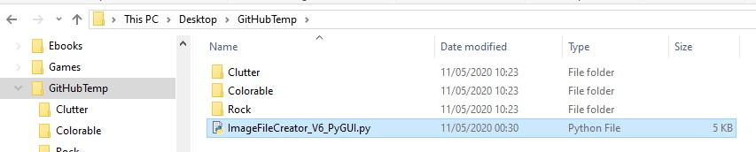
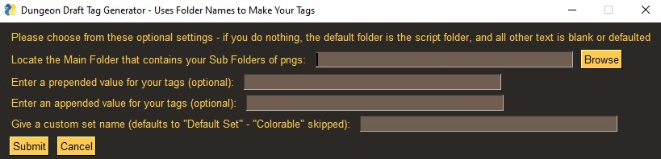

# dungeondrafttagmaker
A simple python script bodged together to turn folders containing pngs into a Tags file for DungeonDraft

# Usage
**1.** Setup your folders as the names of the tags you want to create, and the pngs to include in that tag go inside the folders - you can then place the script in the root folder (optional, the script could be elsewhere) - it should be something like this:

**Note:** You can (and probably should) have the same image in multiple folders if you want it tagged multiple times. This is especially important for anything that is colourable as presumably you will want to tag it at least twice in most cases - once in colourable, once elsewhere. 

**2.** Run the script from your favourite IDE or the Python3 IDLE [tested and working in 3.8 - you will need to install PySimpleGUI: pip3 install pysimplegui]

**3.** You will get a pop up window if all is working as intended, this GUI should be self explanatory, but basically all fields are optional, and they allow you to choose the location of the folder or folders of pngs; to prepend or append anything you like to each tag; and the rename the default set that is created to something custom.

**Note:** The default folder is the one the script is in, and this is where the file outputs to. Also, as mentioned above, the "Colorable" folder will not be included in the default set that is created. This is intentional, not a bug. 

**Final Note:** I am not a professional programmer, and therefore cannot be held responsible for the terrible spaghetti script I have written. If you want to improve it, please feel free to fork and fix. :D
